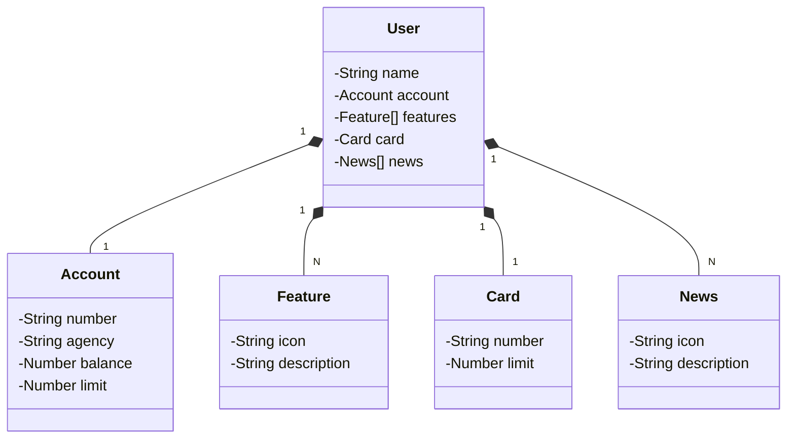

# api-RESTful-nuvem

## Visão Geral do Projeto

Esta API gerencia entidades de um domínio bancário simplificado. A funcionalidade principal, exposta através de endpoints REST, permite a criação e consulta de usuários. Cada usuário possui uma conta, um cartão e uma lista de funcionalidades e notícias associadas.

### O sistema é construído utilizando as seguintes tecnologias:
+ Linguagem: Java 21
+ Framework: Spring Boot 3.4.5
+ Acesso a Dados: Spring Data JPA
+ Banco de Dados: H2 (para desenvolvimento) e PostgreSQL (para produção)
+ Documentação da API: Springdoc OpenAPI (Swagger)
+ Build: Gradle

### Como Acessar a Documentação
1. Com a aplicação em execução, abra seu navegador.
2. Acesse o seguinte URL: http://localhost:8080/swagger-ui/index.html
2. Você verá a interface do Swagger UI, que lista todos os endpoints disponíveis.

### Endpoints da API
+ ```GET /users/{id}```: Busca um usuário pelo seu ID. Retorna os dados do usuário ou um erro 404 Not Found se o ID não existir.
+ ```POST /users```: Cria um novo usuário. O corpo da requisição deve conter os dados do usuário a ser criado. O sistema valida se o número da conta já existe para evitar duplicatas. Exemplo de estrutura:
```json
{
  "name": "-----",
  "account": {
    "number": "12345-6",
    "agency": "0001",
    "balance": 1500.75,
    "limit": 500.00
  },
  "card": {
    "number": "xxxx xxxx xxxx 1234",
    "limit": 1000.00
  },
  "features": [],
  "news": []
}
```
### Diagrama de Classes (Domínio da API)


